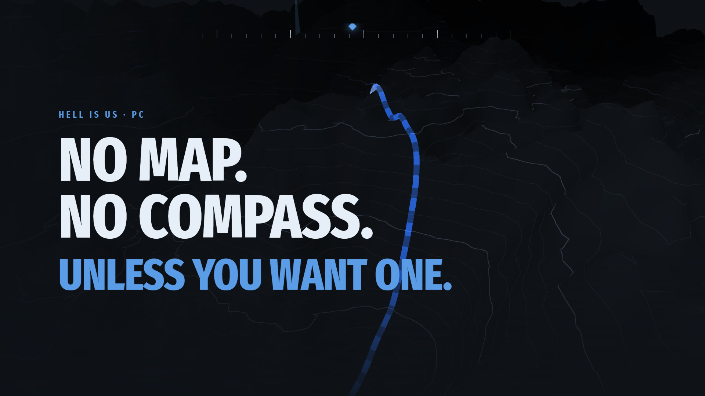

# hiumod — a companion for *Hell Is Us*

[](https://myso-kr.github.io/hell-is-us-mod/assets/media/hiumod-intro.webm)

<sub>▶ [Watch the introduction](https://myso-kr.github.io/hell-is-us-mod/assets/media/hiumod-intro.webm) (WebM, 31 s, silent) · [MP4](https://myso-kr.github.io/hell-is-us-mod/assets/media/hiumod-intro.mp4)</sub>

A live minimap, a quest tracker and story guide, every vault and puzzle answer, and
collectible checklists for *Hell Is Us* on PC — plus a few single-player cheats.
It runs beside the game and reads its memory. **No game files are modified.**

[](https://github.com/myso-kr/hell-is-us-mod/actions/workflows/ci.yml)
[](https://github.com/myso-kr/hell-is-us-mod/releases/latest)
[](CHANGELOG.md)
[](#languages)
[](LICENSE)

**[Website](https://myso-kr.github.io/hell-is-us-mod/)** ·
**[Download](https://github.com/myso-kr/hell-is-us-mod/releases/latest)** ·
[Changelog](CHANGELOG.md)

Read about it in your language:
[한국어](https://myso-kr.github.io/hell-is-us-mod/ko/) ·
[日本語](https://myso-kr.github.io/hell-is-us-mod/ja/) ·
[简体中文](https://myso-kr.github.io/hell-is-us-mod/zh-Hans/) ·
[Deutsch](https://myso-kr.github.io/hell-is-us-mod/de/) ·
[Français](https://myso-kr.github.io/hell-is-us-mod/fr/) ·
[Español](https://myso-kr.github.io/hell-is-us-mod/es/) ·
[Italiano](https://myso-kr.github.io/hell-is-us-mod/it/) ·
[Polski](https://myso-kr.github.io/hell-is-us-mod/pl/) ·
[Português (Brasil)](https://myso-kr.github.io/hell-is-us-mod/pt-BR/) ·
[Русский](https://myso-kr.github.io/hell-is-us-mod/ru/) ·
[Türkçe](https://myso-kr.github.io/hell-is-us-mod/tr/)

> **Unofficial fan-made tool.** Not affiliated with or endorsed by Rogue Factor or
> Nacon. Requires a legitimately purchased copy of the game; this repository contains
> no game code, text or assets. Steam achievements are **not** blocked. Cheats can
> corrupt your save, so back it up first. Provided as is, with no warranty.
> See [NOTICE](NOTICE).

## Quick start

1. **Download** `hiumod-<version>.zip` from [Releases](https://github.com/myso-kr/hell-is-us-mod/releases/latest)
   and unzip it anywhere. It only ever writes to `<game folder>\Mods\`.
2. **Run `hiumod.exe`.** It starts the game through Steam if needed, attaches once you
   are in, and closes when the game does. Play windowed or borderless.
3. **Press <kbd>`</kbd>** (left of <kbd>1</kbd>) for the panel. The first time you
   control the hero, it reads the game's maps and text by itself (about two minutes).
   That needs the [.NET 8 runtime](https://dotnet.microsoft.com/download/dotnet/8.0);
   if it's missing, the panel offers to install it — through winget, or without
   administrator rights into the game's `Mods` folder if winget can't.

**Status:** attaches to Steam build `24045435`, where `doctor` passes every check.
Four cheats are verified in play — `god`, `stamina`, `speed` and `hero_time`; the rest
say *unverified* in the panel until someone confirms them.

## What it does

*Hell Is Us* has no map, no compass and no quest markers by design. hiumod puts them
back for the nights you want them — and every answer starts hidden.

| | |
|---|---|
| **Minimap and big map** | Walls and floors from the level's geometry, shaded terrain and contours, floors above and below faded, your trail, 26 kinds of icons and 24 kinds of pins you place yourself |
| **Compass and guide** | Works the next goal out from what your save knows and what each place still holds, then routes there along the game's own navmesh, with distance and height |
| **Quest tracker** | Main quests, good deeds, mysteries and timeloops by their real names; what the followed quest still needs; good deeds you can still miss, and before when |
| **Vaults and puzzles** | Every dial, keypad and item placement, and the six Vaults of Forbidden Knowledge drawn as the game's own symbols — each behind *Show answer* |
| **Collect** | Collectibles per region, enemy groups left for the every-Hollow achievement, NPCs with more to tell, Steam achievements with progress |
| **Saves** | Each game save copied to `Mods\backups` (the last 20) |
| **Cheats** | Health, stamina, Lymbic energy, speed, time scale, frail enemies, consumables, weapon XP, saved positions — off until switched on, put back when switched off |

Every overlay hides while a game menu is open.

### Keys

| Key | |
|---|---|
| <kbd>`</kbd> | show or hide the panel |
| <kbd>F9</kbd> | minimap → big map → off |
| <kbd>F10</kbd> | compass |
| <kbd>F11</kbd> | guide to the next goal |
| <kbd>F6</kbd> | place or remove a pin |

All of them can be changed in the panel.

## Languages

The mod speaks the game's language. It follows the game's own text setting in all
twelve languages the game ships — English, Korean, Japanese, Simplified Chinese,
German, French, Spanish, Italian, Polish, Brazilian Portuguese, Russian and Turkish —
and takes the names of places, people and items from the game's translations on your
machine. Each language had a native-speaker pass against the game's own terms.

## Command line

```
hiumod doctor          # checks everything, writes nothing — load a save first
hiumod doctor survey   # the guide's data from your game files (the panel does this itself)
hiumod hold god stamina speed=1200  # until Ctrl+C, then puts things back
hiumod restore         # if a hold was killed rather than stopped
hiumod help            # every command
```

The same commands work in the panel's console.

## How it finds its way in

The tool stores no offsets. Each time it attaches:

1. It scans the game image's writable data for the engine's name pool and for
   `GEngine`. Each must turn up exactly once.
2. It reads the engine's own reflection to learn the path to the player:
   `GameInstance → LocalPlayers[0] → PlayerController → Pawn`, then the pawn's
   `AbilitySystemComponent → SpawnedAttributes`.
3. It finds each attribute by the game's own name, such as `EnduranceCap` or
   `LymbicEnergy`.

So a Steam patch only breaks something when it renames something, and `doctor` says
which name went missing.

### Safety rules the code keeps

- **The hero gate.** Nothing is written unless the controlled pawn is the hero, a
  `CharlieCharacterHero`. Loading screens, menus and cinematics close the gate; held
  cheats pause while it is closed rather than being dropped.
- **Every write lands on an attribute or nowhere.** An attribute must be declared
  16 bytes (an `FGameplayAttributeData`) and start with the vtable all attributes
  share, inside the game image.
- **Originals go to disk first.** `originals.txt` is written before anything is
  overwritten. Switching off, closing the panel or running `restore` puts them back.

## Building

```
cargo test                       # unit and integration tests, no game needed
cargo build --release
powershell tools/package.ps1     # dist\hiumod-<version>.zip: the exe, the survey tool, the documents
python tools/site/build.py       # the website in docs/ (GitHub Pages: main /docs)
```

The survey tool (`tools/survey`, C# with CUE4Parse) needs the .NET 8 SDK to build.

**Releasing.** Rename the newest `CHANGELOG.md` heading from `Unreleased — X.Y.Z` to
`X.Y.Z`, set the same version in `Cargo.toml`, then
`git tag vX.Y.Z && git push origin vX.Y.Z`. [`release.yml`](.github/workflows/release.yml)
checks that the three agree, builds the zip on Windows, checks that nothing from the
game is in it, and publishes it with the verified Steam build, install steps, the
changelog section and a SHA-256.

## Documentation

| Document | What it settles |
|---|---|
| [CHANGELOG.md](CHANGELOG.md) | what each release changed, and the game build it was verified on |
| [.spec/PLAN.md](.spec/PLAN.md) | what this is, the phases, and what each one attaches to |
| [.spec/ANCHORS.md](.spec/ANCHORS.md) | how the tool finds its way in, and what a game update can break |
| [.spec/CHEATS.md](.spec/CHEATS.md) | the cheats, what each writes, and what "verified" means |
| [.spec/](.spec/README.md) | handoff documents in Korean: status, procedures, structure, decisions, research, the website |

## FAQ

**Is there a map in *Hell Is Us*?** No. By design the game has no map, compass or
quest markers. hiumod adds an optional minimap overlay and a quest tracker on PC.

**Can I get banned?** *Hell Is Us* is single-player with no anti-cheat and no online
play, and hiumod changes no game files. As with any third-party tool, use it at your
own discretion.

**The game updated and something broke.** Run `hiumod doctor`; it names anything that
moved. Run `doctor survey` again for the guide's data, and open an issue with the
doctor output if it stays broken.

## License

Code under the [MIT license](LICENSE); bundled third-party material in
[THIRD-PARTY.md](THIRD-PARTY.md). *Hell Is Us* is a trademark of its owners.
